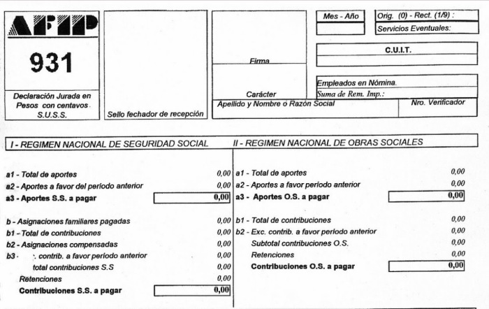
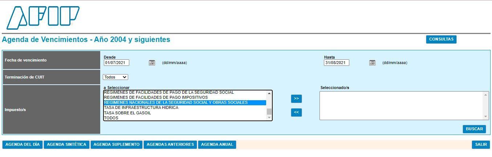
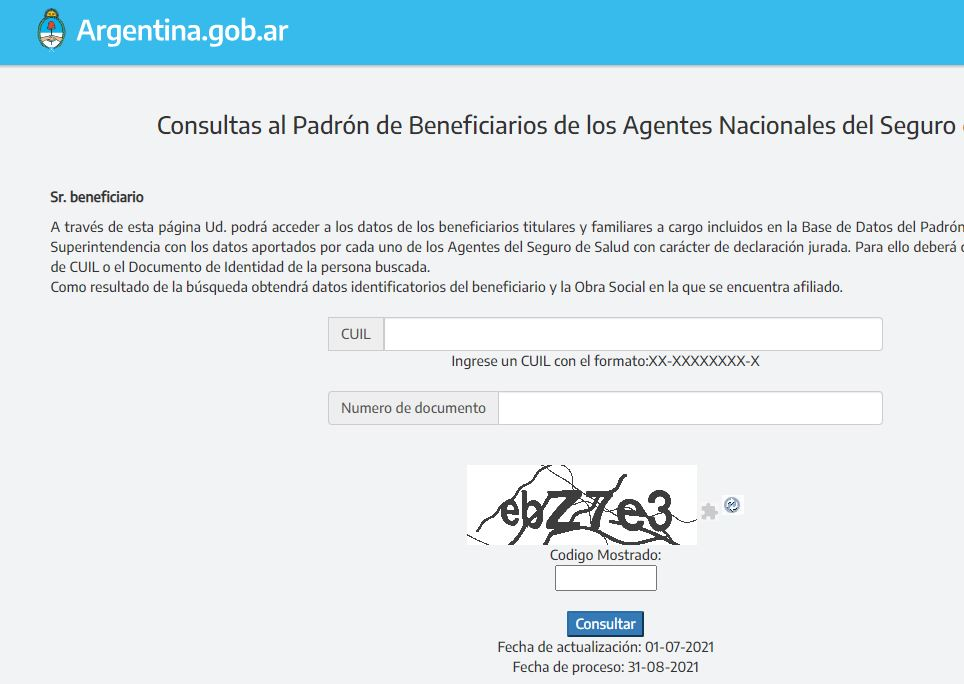

```{r setup, include=FALSE} 
knitr::opts_chunk$set(warning = FALSE, message = FALSE) 
```

Nuestro nuevo dataset, solo tiene ...


## << Borrador >>

## Presentación 

El presente documento es un anexo al documento principal  referido al procesamiento de novedades de liquidación. 


## Objetivo


Presentamos a continuación los conceptos básicos de Liquidación de Sueldos, los cuales serán utilizados en el documento principal.
(pd: acá iria el enlace del proyecto de procesamiento de novedades)


------------------------------------------------------------------------

Para comenzar, configuramos el encabezado de nuestro documento {RMarkdown}  segun los objetivos buscados. 
(ver si profundizamos)

Luego seleccionamos un theme que nos resulte pertinente. Podes consultarlos en el siguiente enlace [Themes](https://bootswatch.com/3/)


Las librerias que  utilizamos para el presente documento, son las siguientes: 


```{r }


library(googlesheets4)  # para trabajar con google drive
library(kableExtra) # para tablas lindas


```


Incorporamos los siguientes archivos  y creamos objetos para cada uno. 
La creación de objetos, nos permite la manipulación más ordenada de los datos:


```{r}


SMVM <- read_sheet("1dFlrOU7HS35C4FSwinlKFKzDI7IdmIfoXSkddPr9ScQ")
Vacaciones <- read_sheet("1Def-yNRZFsWNfSfsr0hgZ5z7EVqtvOtdsypAF1GYiT8")
Licencias <- read_sheet("1-P07kXrYuvdndwe0Lb98Qcko2F9MRINbynQHFybcam4")
Inculpable <- read_sheet("1-P07kXrYuvdndwe0Lb98Qcko2F9MRINbynQHFybcam4", sheet = "Inculpable") # 2° hoja


```


Si existen elementos que vamos a utilizar reiteradamente, es conveniente crearlos al inicio y luego simplemente  los invocamos: 


```{r}

fuente <- "Fuente: Elaboración propia"
azul <- "#344D7E"


```


------------------------------------------------------------------------

## Normativa

En el presente documento, vamos a utilizar en lineas generales la [ley de contrato de trabajo](http://servicios.infoleg.gob.ar/infolegInternet/verNorma.do?id=25552) que regula las relaciones laborales en el ambito privado.

Los intitutos presentados pueden variar según cada convenio, pero siempre manteniendo el espiritu buscado por la normativa general. 

------------------------------------------------------------------------

## Modalidades de Contratación {.tabset .tabset-fade .tabset-pills}

Existen diversas modalidades de contratación.
Detallamos a continuación las principales.

### Contrato por tiempo Indeterminado

La ley de contrato de trabajo prevé que el contrato de trabajo será por tiempo indeterminado a menos que se especifique otra modalidad.

No requiere formalidad alguna, y basta con el solo consentimiento inequívoco de las partes para que quede celebrado.
Presenta la particularidad que durante los primeros tres meses el contrato de trabajo sea considerado a prueba.

### Período de prueba

Forma parte de contrato de trabajo por tiempo indeterminado, el cual en su inicio puede adoptar esta modalidad.
Por ello se debe hablar de contrato de trabajo por tiempo indeterminado "con" o "sin" período de prueba.

Presenta las siguientes particularidades:

-   Duración: Hasta tres meses.

-   Exclusión: No se aplica en el caso de trabajadores de temporada.

-   Ruptura unilateral: Durante el período de prueba cualquiera de las partes puede extinguir la relación laboral sin causa, sin deber de indemnizar.

-   Deber de Preavisar: Es de quince días, obligación esta dirigida al empleador y también al trabajador.

-   Registración: Al momeNto de dar el alta en AFIP se indica la modalidad de contratación "14", en caso de no hacerlo se considera que la empresa renuncia al uso del mismo.

-   Recontratación: Un mismo trabajador no puede ser contratado por el mismo empleador más de una vez con período de prueba.

### Contrato de Trabajo a Tiempo Parcial

El trabajador presta servicios durante un determinado número de horas al día o la semana, menos de dos tercios de la jornada habitual de la actividad.
La remuneración es proporcional a lo que cobra el trabajador a tiempo completo de la misma categeoría.

###  Contrato por Tiempo Determinado

Los contratos de trabajo por tiempo determinado son, la excepción a la regla y obedecen a situaciones excepcionales que determinan la necesidad de recurrir a este tipo de contratos.

Solo cuando la situación así lo exija, las partes podrán aplicar estas modalidades contractuales las cuales están previstas en la ley.
Además de la contingencia del plazo determinado, existen otras contingencias para las cuales la ley prevé modalidades específicas.
Las modalidades contractuales son las siguientes:

### Contrato a Plazo Fijo

En el contrato escrito, se debe especificar concretamente cuál es la causa que deriva en esta modalidad contractual.
Se debe, a su vez, fijar la fecha de finalización en forma expresa.
El registro en el sistema de simplificación registral de AFIP no sustituye la necesaria instrumentación escrita y firmada por las partes.

La registración en el sistema "Mi Simplificación" es mediante los códigos "21" o "22" (tiempo parcial o jornada completa, respectivamente), indicando fecha de finalización prevista.

El plazo máximo de duración es de cinco (5) años, sin que la ley prevea un plazo mínimo.

Como regla general, y así lo indica la norma, no se admiten contratos sucesivos si no media una causal objetiva que lo justifique (obra, actividad extraordinaria fuera del giro normal del establecimiento, reemplazo de personal, etcétera).

Preaviso: si el plazo del contrato supera el mes, el empleador debe preavisar fehacientemente su finalización dentro de un plazo anterior de la fecha de finalización superior al mes e inferior a dos meses.
La falta de notificación del preaviso convierte, a modo de sanción, al contrato a plazo determinado en uno de tiempo indeterminado en forma automática.

Al momento de la extinción no se requiere notificar al trabajador, pero como hemos señalado cuando es superior al mes siempre se requiere cumplir con la formalidad del preaviso notificado en forma fehaciente.
Nada obsta que el contrato a plazo fijo se extinga por otras causales previstas en la ley (renuncia, mutuo acuerdo, abandono, despido indirecto, con causa, etc.)

### Contrato de Trabajo Eventual

La actividad del trabajador se ejerce bajo la dependencia de un empleador para resultados concretos para servicios extraordinarios determinados de antemano o exigencias extraordinarias y transitorias de la empresa, explotación o establecimiento cuando no puede preverse un plazo cierto para finalizar el contrato.

En estos casos el vínculo comienza y termina con la realización de la obra, la ejecución del acto o la prestación del servicio.

### Contrato de Trabajo por Temporada

Por la naturaleza de la actividad, las tareas se desarrollan en determinadas épocas del año y se repiten anualmente.

Las modalidades de contratación se cargan en el legajo de cada empleado, y las mismas son declaradas en el Formulario 931.

Para mayor informacion sobre modalidades de contratación , se puede consultar la normativa aplicable en el siguiente enlace:

[Modalidades de contratación](https://www.argentina.gob.ar/trabajo/guiadecontratacion).

------------------------------------------------------------------------


## Sueldo


**Salario Minimo Vital y Movil**

El Salario Mínimo Vital y Móvil, de acuerdo con la Ley de Contrato de Trabajo, se define como "la menor remuneración" que debe percibir en efectivo el trabajador sin cargas de familia, en su jornada legal de trabajo.
El Consejo Nacional del Empleo, la Productividad y el Salario Mínimo Vital y Móvil (CNEPSMVM) determina periódicamente el Salario Mínimo.
Los importes vigentes son los siguientes:

```{r}

SMVM%>% 
  kable("html", escape=F) %>%
    kable_styling(full_width = TRUE, bootstrap_options = c("striped","hover","condensed" )) %>% 
row_spec(0, bold=T, color="white", background = azul)


```

**Salario Básico**

El sueldo básico no puede ser inferior al SMVM.

Para los empleados fuera de convenio, el sueldo se conforma entre las partes.
Para los empleados dentro de convenio, el mismo depende de las negociaciones en paritarias.
Cada gremio determinará el sueldo correspondiente


**Antiguedad**

La antigüedad es el tiempo de servicio efectivo que un trabajador tiene en su lugar de trabajo, desde su ingreso o vinculación laboral.
Si el empleado egresa de la compañia y reingresa a las ordenes del mismo empleador, mantiene la misma antiguedad.

**Categoría Laboral**

Las categorías laborales estan definidas en cada convenio colectivo de trabajo.
La asignación de las mismas, depende de la tarea realizada.

A cada categoría le corresponde un sueldo básico determinado y según la tarea realizada, corresponderan adicionales que especifique el convenio.

## Jornada Laboral

La jornada laboral es el plazo de tiempo durante el cual el empleado se encuentra a disposición del empleador.

La jornada laboral esta regulada por la LCT y la [Ley 11544](http://servicios.infoleg.gob.ar/infolegInternet/verNorma.do?id=63368)

*Jornada de trabajo Diurna* : Es aquella que se realiza en tre las 06:00hs y 21hs no debe superar las 8 horas diarias o las 48 semanales.
Se trata de un límite máximo, por eso pueden existir jornadas con una duración menor.

Si no trabaja la misma cantidad de horas todos los días, ¿cuánto es el máximo de horas diarias que debe cumplir?

No más de 9 horas por día.
En total, las jornadas no pueden sumar más de 48 hs.
por semana.

*Jornada de trabajo Nocturna* : Es aquella que se realiza entre las 21:00hs y 06hs, el límite máximo de la jornada es 7 horas.

*Jornada de trabajo Insalubre* : Es aquella que el Ministerio de Trabajo ha decretado como insalubre, el límite es de 6 horas diarias.

*Jornada de trabajo mixta* : Corresponde cuando se alteren horas diurnas y nocturnas, porque el trabajo comienza antes de las 21hs y finaliza después de esa hora, o comienza antes de las 6:00 hs y finaliza después de esa hora.
En este caso debe reducirse proporcionalmente la jornada en ocho minutos, por cada hora nocturna trabajada, o pagarse los ocho minutos de exceso como tiempo suplementario, al 50% o al 100% según corresponda.


**Trabajo Insalubre**

La duración del trabajo no puede ser mayor a 6 horas diarias o 36 semanales.

Si alterná trabajo insalubre con trabajo salubre, la jornada puede ser de 8 horas.

Pero cada hora trabajada en el lugar insalubre se considera como 1 hora y 33 minutos.
No podés permanecer más de 3 horas por día en ese lugar.

**Horas Extras**

La ley de Jornada Laboral prevee una jornada semanal de 48hs.

Cualquier trabajo que haya excedido el limite de dicha jornada, debe ser remunerado como horas extra.

Limite de Horas extras:

El [Decreto 484/2000](http://servicios.infoleg.gob.ar/infolegInternet/anexos/60000-64999/63347/norma.htm) fija límites para la realización de horas extras:

◼️ 3 horas por día.

◼️ 30 horas mensuales.

◼ 200 horas anuales.


##### Horas Extras al 50%

Si la prestacion se realizo desde el Lunes hasta el sábado a las 13hs, cada hora extra laborada debe abonarse con un recargo del 50%.

##### Horas Extras al 100%

Si la prestación se realizo un día feriado, sábados después de las 13hs o domingos, cada hora extra laborada debe abonarse con un recargo del 100%.

**Horas Nocturnas**

El trabajo nocturno no puede durar más de 7 horas y tiene que cumplirse entre las 9 de la noche y las 6 de la mañana.

Si trabaja una parte durante el día y otra parte durante la noche, ¿cuál es la jornada de trabajo?

Las horas que trabaja entre las 9 de la noche y las 6 de la mañana valen como 1 hora y 8 minutos para calcular la jornada de trabajo.

**Horas Nocturnas al 50%**

Corresponde cuando el horario nocturno realizado por el trabajador, coincida con horas extras al 50%.

**Horas Nocturnas al 100%**

Corresponde cuando el horario nocturno realizado por el trabajador, coincida con horas extras al 100%.

**Francos**

El día de franco, o de descanso semanal, es un lapso en las que el trabajador no debe realizar tareas laborales.
El objetivo principal del franco es de la recuperación de energía del trabajador luego de haber desempeñado sus tareas, que pueden haber exigido esfuerzo físico y/o psíquico.

**Francos Trabajados**

Si el empleado presta servicios un dia de franco, entonces corresponde abonar el dia con el 100% de recargo.

**Dia no laborable**

Días no laborales u optativos, son los empleadores quienes pueden optar por convocar o no a trabajar.
Si no los convoca, no afectará el cobro del dia laboral, y en caso de ser convocados, percibiran el salario simple, sin ningún incremento.

**Feriados**

Es aquel día en los que la ley dispone que no se presten tareas laborales por conmemorarse alguna celebración religiosa, historia o algún otro evento de índole similar.

Se pueden consultar los dias feriados y no laborables en la siguiente página [Ministerio del Interior](https://www.argentina.gob.ar/interior/feriados-nacionales-2021).

**Feriados Trabajados**

En el caso que el empleado trabaje un feriado, tiene una bonificación del 100% extra de su valor.

**Distribucion del Horario Laboral**

El empleador se encuentra autorizado legalmente a diagramar los horarios de trabajo cumpliendo los siguientes recaudos:

-   Los horarios de trabajo se deben hacer públicos en lugares visibles para conocimiento de todo el personal

-   Entre el cese de una jornada y el comienzo de la otra debera mediar una pausa no inferior a 21 horas

-   Durante la semana se pueden distribuir las horas de manera desigual (más horas un día y menos otro), pero en ningún caso puede superar las 9 horas diarias de trabajo

-   Respetar el descanso semanal de 35 horas corridas a partir del sábado a las 13 horas

### Licencias

**Vacaciones**

Es una licencia anual, que corresponde segun la antiguedad del empleado.
La antigüedad se computa al 31 de diciembre del año al cual corresponden las vacaciones.

¿Cuántos días corresponden por vacaciones?

```{r}

Vacaciones%>% 
  kable("html", escape=F) %>%
    kable_styling(full_width = TRUE, bootstrap_options = c("striped","hover","condensed" )) %>% 
row_spec(0, bold=T, color="white", background = azul)

```

¿ Qué pasa el primer año trabajado?

Cuando los empleados no llegaron a prestar servicios la mitad de los días laborables del año, la ley indica que gozarán de un día de vacaciones por cada veinte días de prestación efectiva.
En este sentido, se consideran como días trabajados aquellos en que el dependiente no preste servicios por gozar de una licencia convencional o legal, o por estar enfermo o accidentado, o por otras causas no imputables al mismo.
Se deberá determinar los días hábiles de acuerdo con el régimen propio de trabajo (si se labora o no el sábado; si se realiza actividad o no los días optativos, etc.)

Consideraciones generales:

◻️ Las vacaciones se deben notificar por escrito con 45 días de anticipación.

◻️ Los dias son corridos, salvo lo indique el convenio.

◻️ Las vacaciones comienzan un Lunes, salvo que la persona preste servicios en días inabiles, en ese caso comienzan luego del descanso semanal.

◻️ Las vacaciones se conceden entre el 1º de octubre y el 30 de abril del año siguiente.

◻️ A un período de vacaciones puede sumársele la tercera parte del período de vacaciones inmediatamente anterior que no se hubiere gozado.

◻️ Para el pago se tienen en cuenta los conceptos fijos y un promedio de los conceptos variables.
El valor del día es con divisor 25.


**Enfermedad y Accidente Inculpable**

Las enfermedades inculpables son las contingencias que sufre el trabajador y que no tienen origen en el trabajo.(Ejemplo: gripe).
Estan cubiertos por la obra social del trabajador.

Dichas contingencias imposibilitan al empleado a prestar teareas, generando el derecho a gozar de una licencia paga por cada enfermedad o accidente inculpable por un periodo variable, según la antiguedad y cargas de familia del colaborador.

```{r}

#gt(Inculpable)%>% 
#  tab_header(title = "Enfermedad Inculpable ") %>%
#  tab_source_note(source_note = fuente)

Inculpable%>% 
  kable("html", escape=F) %>%
    kable_styling(full_width = TRUE, bootstrap_options = c("striped","hover","condensed" )) %>% 
row_spec(0, bold=T, color="white", background = azul)


```

**Reserva de Puesto**

Vencido el plazo que le corresponda de goce por enfermedad, y si el empleado no se encuentra en condiciones de reintegrase, ingresa en lo que se denomina periodo de reserva o conservación de puesto.
El plazo máximo de duración es de 1 año y es sin goce de haberes.
El ingreso a este periodo debe notificarse de manera fehaciente al trabajador (por carta documento).

Una vez que transcurra el año, y en el caso que el empleado no se reintegrara a trabajar, por continuar su enfermedad, la relación se mantiene vigente salvo que alguna de las partes comunicara a la otra, su intención de finalizar la relación laboral, eximiendo el pago de indemnización.
Esta notificación debe ser también de manera fehaciente.

**Enfermedad y Accidente Laboral**

Se considera accidente a todo acontecimiento ocurrido por el hecho o en ocasión del trabajo, o en el trayecto entre el domicilio del trabajador y el lugar de trabajo, siempre y cuando el damnificado no hubiere interrumpido o alterado dicho trayecto por causas ajenas al trabajo.

El trabajador podrá declarar por escrito ante el empleador, y éste dentro de las 72 horas ante el asegurador, que el "itinere" se modifica por razones de estudio, concurrencia a otro empleo o atención de familiar directo enfermo y no conviviente, debiendo presentar el pertinente certificado a requerimiento del empleador dentro de los 3 días hábiles de requerido.

Se consideran enfermedades profesionales aquellas que están incluidas en el listado de enfermedades profesionales.

En caso de enfermedad o accidente laboral se realiza la denuncia del siniestro ante la ART, quien evaluara el mismo y podra solicitar documentacion o información adicional.
El empleador abonara los primeros 10 dias del accidente, los dias posteriores se hace cargo la ART.
Los salarios por los dias de accidente, los abona la empresa, y luego la empresa realiza las gestiones con la ART para solicitar el recupero de los mismos.

Para mayor informacion sobre los riesgos de trabajo, podes consultar en

[Superintencia de Riesgos de Trabajo](https://www.argentina.gob.ar/srt).

**Licencias Especiales**

Las licencias generales establecidas en la LCT son las siguientes:

```{r}


#gt(Licencias)%>% 
#  tab_header(title = "Licencias Especiales") %>%
#  tab_source_note(source_note = fuente)

Licencias%>% 
  kable("html", escape=F) %>%
    kable_styling(full_width = TRUE, bootstrap_options = c("striped","hover","condensed" )) %>% 
row_spec(0, bold=T, color="white", background = azul)

```

Cada licencia se deberá justificar con la acreditación correspondiente

### Embargos

Los embargos son disposiciones oficiales, determinadas por jueces y son informados a las empresas por oficios.
Cuando la empresa es notificada en forma fehaciente del mismo, esta obligada a aplicar la notificacion correspondiente, sea una retención o un cese de la misma.
Cuando se finaliza el embargo, se puede solicitar un libre de deuda en el juzgado correspondiente.

Para mayor informacion sobre embargos, se puede consultar la normativa aplicable en el siguiente enlace [Embargos](http://servicios.infoleg.gob.ar/infolegInternet/anexos/75000-79999/77255/norma.htm).

Hay dos tipo de Embargos:

**1- Embargo de Alimento**

Son embargos por deuda de alimento.
El limite lo determinan los jueces.
La determinacion de los conceptos alcanzados, depende de cada oficio.
Puede ser valores fijos o variables.

**2- Embargo Comercial**

La normativa de embargos dispone, para embargos comunes o comerciales, que las remuneraciones mensuales brutas (antes de descuentos de ley) devengadas por el trabajador, así como el SAC, son inembargables hasta la suma del SMVM.

Lo que exceda del SMVM puede ser embargado, según el siguiente procedimiento:

Para remuneraciones brutas inferiores a DOS (2) veces el SMVM, hasta el 10% de lo que exceda del SMVM.

Para el caso de retribuciones brutas superiores a DOS (2) veces el SMVM, hasta el 20% de lo que supere el SMVM.

A su vez, en los meses donde se abone el aguinaldo, se deberá computar un 50% del SMVM para comparar con ese SAC, a efectos de determinar los porcentajes antes aludidos.

------------------------------------------------------------------------

### Seguridad Social

**Formulario 931**

El formulario 931 se trata de una declaración jurada que especifica los aportes y contribuciones a la seguridad social.

La declaración es por cada colaborador que se haya dado de alta en el periodo a presentar.

Los datos que se declaran, son los que figuran en el legajo del empleado, asi como la liquidacion de sueldos del período.



El vencimiento del F 931, depende de la terminación del CUIT de la empresa.

Las fechas de vencimiento, se declaran en la siguiente pagina [Vencimientos](https://seti.afip.gob.ar/av/seleccionVencimientos.do)



**Obra Social**

-General: Todos los empleados acceden a la obra social sindical de la actividad.

Otorgar la obra social, es responsabilidad de la empresa, pero darse de alta en la misma, es un tramite personal.

-Prepaga: La empresa puede otorgar como beneficio una prepaga, para ello desregula los aportes mediante una obra social Jerárquica.
La diferencia que se genera por el otorgamiento del beneficio, es un costo de la empresa.

-Cambio de Obra social: Los empleados tienen derecho a cambiar de obra social, una vez por año.
Es un tramite personal.
en caso de realizarlo, tienen que presentar el formulario de cambio de obra social, a fin de actualizar su legajo en el sistema y declararlo correctamente ante AFIP.

-Las obras sociales, se cargan en el legajo del empleado, la misma es declarada en el Formulario 931.

-Consulta de obra social: Se puede consultar la obra social vigente del empleado, en el siguiente enlace [Padron de Obras sociales](https://www.sssalud.gob.ar/index.php?page=bus650&user=GRAL).



**Asignaciones Familiares**

Las asignaciones familiares, las abona ANSES, se pueden consultar las mismas en el siguiente enlace [Anses](https://www.anses.gob.ar/asignaciones-familiares).

*Montos de las asignaciones familiares*

Los valores de las asignaciones se van actualizando en diferentes momentos del año.

Para acceder al cobro de las mismas, va a depende del ingreso del grupo familiar (IGF).

En el caso que el empleado supere el monto individual del IGF, se excluye el cobro de las mismas.

Las remueneraciones que considera Anses para el pago de las asignaciones familiares son las siguientes:

◼️️ Las remuneraciones brutas y sumas no remunerativas decladas en el Formulario 931

◼️ Se excluyen las horas extras, el plus por zona desfavorable y el aguinaldo

**Relaciones Laborales**

En el caso de realizar un alta, baja o modificación de un empleado, la misma debe ser reflejada en AFIP.
El procedimiento se puede consultar en la siguiente página [ABM](https://serviciosweb.afip.gob.ar/genericos/guiaDeTramites/VerGuia.aspx?tr=47)

***¿Cuál es el plazo para dar de alta a un trabajador?***

Hasta el día inmediato anterior, inclusive, al de comienzo efectivo de las tareas.

***¿Cuál es el plazo para dar de baja a un trabajador?***

Debe realizarse dentro del plazo de 5 días corridos contados a partir de la fecha --inclusive- en que se produjo la extinción del contrato de trabajo, por cualquier causa.

***¿Cuál es el plazo para la modificación de datos?***

Los datos del empleador y del trabajador que no se actualicen automáticamente en el sistema mediante la información suministrada por otras bases de datos, deben ser modificados dentro de los 5 días hábiles de haber ocurrido el evento que origina el cambio.

***¿Cuál es el plazo para anular un alta?***

La anulación del alta se realiza cuando no se concreta la relación laboral.

Dicha anulación deberá efectuarse hasta las 24 horas, inclusive, del día informado como de inicio de la relación laboral.

No obstante, el citado plazo se extenderá hasta las 12 horas del día siguiente, cuando la jornada laboral esté prevista iniciarse desde las 17 horas en adelante.

Asimismo, la relación laboral que se inicie un día inhábil , podrá ser anulada hasta las 12 horas del primer día hábil siguiente

------------------------------------------------------------------------

*En caso de encontrar observaciones, información incompleta o que deseen ampliar, por favor te  invitamos a que nos escriban para poder darle solución inmediata.*

\


