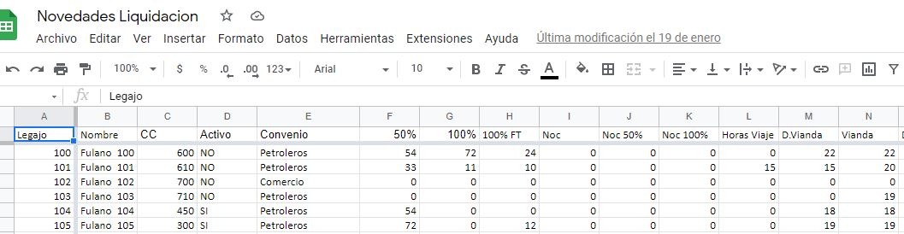

```{r setup, include=FALSE}
knitr::opts_chunk$set(warning = FALSE, message = FALSE) 


```

{width="400" height="400"}

### Objetivos

{width="500px"}

Datos:

{width="500px"}

### Destinatarios

{width="500px"}

{width="400px"}

### Aclaraciones

{width="500px"}

[Teórico](https://rpubs.com/YanelPaulette/Basicos)

------------------------------------------------------------------------


### Procedimiento

**Paquetes**

```{r}
library(tidyverse)      
library(googlesheets4)  
library(gargle)         
library(funModeling)    
library(kableExtra)
library(tm)
library(lubridate) 
library(datos)
library( hms)
library(rmdformats)
```

Creamos objetos que vamos a utlizar en diversas oportunidades y solo debemos invocarlos.

```{r}

blue <- "#344D7E"

fuente <- "Fuente: Elaboración propia"
```

------------------------------------------------------------------------

### Primer Caso

**Base de Datos**

Incorporamos las bases de datos a utilizar. Las mismas las tenemos en el drive:

{width="900px"}

```{r}
original_1 <- read_sheet("1_AUDkMkG80ribPRl76M2KWtqwDk_hWiM7IOzKSZ6N14") # 1° hoja
egreso_1 <- read_sheet("1_AUDkMkG80ribPRl76M2KWtqwDk_hWiM7IOzKSZ6N14", sheet = "2") #la 2° hoja

```

Almacenamos los datos en objeto para evitar usar la base original.

```{r}
n1<- original_1
e1<- egreso_1

```

Formateamos nombres de las columnas.

```{r}

limpios <- make.names(colnames(n1)) 
colnames(n1) <- limpios
rm(limpios) 

limpios <- make.names(colnames(e1)) 
colnames(e1) <- limpios
rm(limpios) 

```

Consultamos el tamaño de nuestro dataset.

```{r}
dim (n1)
```

Vemos ahora, si las columnas tienen nombres inadecuados para trabajar. De ser necesario los modificamos.

```{r}
names(n1)
```

Cambiamos los nombres de las columnas.

```{r}

n1 <- n1 %>% 
  rename("Hs.Extras.50%" = "X50.")%>% 
  rename("Hs.Extras.100%" = "X100.")%>% 
  rename("Hs.Feriado" = "X100..FT")%>% 
  rename("Hs.Noct" = "Noc")%>% 
  rename("Hs.Noct.50%" = "Noc.50.")%>% 
  rename("Hs.Noct.100%" = "Noc.100.")%>%
  rename("Hs.Viaje" = "Horas.Viaje")%>%
  rename("2°Vianda" = "D.Vianda") %>%
  rename("Centro.Costo" = "CC") 

```

```{r}
n1<- n1%>% 
  select(Legajo, Centro.Costo,  Activo, Convenio, `Hs.Extras.50%`, `Hs.Extras.100%`, Hs.Noct, Enfermedad, Vacaciones )
```

¿ Qué tipo de análisis podemos hacer?

En primer lugar podemos conocer cantidades.

```{r}
Nomina<- n1 %>% 
  select(Activo) %>%
  mutate(cuenta = 1) %>% 
  group_by(Activo) %>% 
  summarise(Cuenta = sum(cuenta)) %>% 
  arrange(-Cuenta)

Nomina


```

Podemos mejorar la visualización.

```{r}

Nomina$TIP <- c("Podemos destacar algo")

Nomina%>% 
  mutate(Cuenta=text_spec(Cuenta, "html", tooltip=TIP)) %>% 
    select(Activo,Cuenta) %>% kable("html", escape=F) %>% 
    kable_styling(full_width = TRUE, bootstrap_options = c("striped","hover","condensed" )) %>% 
row_spec(0, bold=T, color="white", background = blue) %>% 
  footnote(general = fuente)


```

Ahora veamos de aquellos que son baja, cuales fueron los motivos de egreso.

```{r}

names(e1)
names(n1)

```

Seleccionamos las columnas con las que vamos a trabajar:

```{r}
e1<- e1%>%
  select(Legajo, Fecha.de.Ingreso, Fecha.de.Egreso, Motivo.de.Egreso)

```

Luego, unimos las tablas por la columna en comun "Legajo":

```{r}

e1 <- left_join(n1, e1, by = "Legajo")

e2<-e1%>%
  select(Legajo:Convenio, Motivo.de.Egreso) %>%   # Usamos rangos, y columnas independientes
  filter(Activo=="NO")  %>%  
  mutate(cuenta = 1) %>% 
  group_by(Motivo.de.Egreso) %>% 
  summarise(Cuenta = sum(cuenta)) %>% 
  arrange(-Cuenta)


```

Finalmente presentamos la información en una tabla:

```{r}

e2$TIP <- c("Egresos del mes") 

e2%>% 
  mutate(Cuenta=text_spec(Cuenta, "html", tooltip=TIP)) %>% 
    select(Motivo.de.Egreso,Cuenta) %>% kable("html", escape=F) %>% 
    kable_styling(full_width = TRUE, bootstrap_options = c("striped","hover","condensed" )) %>% 
row_spec(0, bold=T, color="white", background = blue) %>% 
  footnote(general = fuente)

```

Unifiquemos motivos de egreso:

```{r}
 e2<-  e2 %>%
 mutate(Motivo.de.Egreso = fct_collapse(Motivo.de.Egreso, "Desp C/C" = c("Desp C/ Causa","Despido con causa", "Despido C/C")),
        Motivo.de.Egreso = fct_collapse(Motivo.de.Egreso, "Desp S/C" = c("Despido sin C","Despido sin causa", "Despido S/C")))
```

```{r}

e2 %>%   
  mutate(cuenta = 1) %>% 
  group_by(Motivo.de.Egreso) %>% 
  summarise(Cuenta = sum(cuenta)) %>% 
  arrange(-Cuenta)%>%
  kable("html", escape=F) %>% 
    kable_styling(full_width = TRUE, bootstrap_options = c("striped","hover","condensed" )) %>% 
row_spec(0, bold=T, color="white", background = blue) %>% 
  footnote(general = fuente)

```

------------------------------------------------------------------------

### Segundo Caso

------------------------------------------------------------------------

**Base de Datos**

Incorporamos las bases de datos a utilizar.

{width="900px"}

```{r}
original_2 <- read_sheet("1JOrvsv_C6Kn7tCdaAwqDNJjUC2MEdaZ8Ivj3z6rH3ds", skip=1)

```

Cramos un objeto para manipularlo y evitar usar las bases originales.

```{r}
n2 <-original_2

```

Consultamos el tamaño de nuestro dataset.

```{r}
dim (n2)
```

¿ Qué buscamos con este archivo?

{width="300px"}

Consultamos las variables

```{r}
glimpse(n2)
```

Eliminamos columnas que ya sabemos no vamos a usar.

{width="950px"}

```{r}
 
n2<- n2 %>%
  select(everything()) %>%
  select(-Sem1:-Sem5)


```

Pasamos a mayúsculas, por una cuestión visual.

{width="650px"}

```{r}

n2 <- mutate_if(n2, is.factor, toupper)
n2 <- mutate_if(n2, is.character, toupper)

```

------------------------------------------------------------------------

**Situación**

{width="450px"}

{width="350px"}

------------------------------------------------------------------------

**¿Cómo necesitabamos los datos??**

{width="250px"}

¿Cómo los tenemos ahora?

{width="900px"}

Para lograrlo aplicamos un poco de magia:

{width="950px"}

```{r}
 
n2<- n2 %>%
  pivot_longer(cols = c(`16/12/2021`:`31/12/2021`), names_to = "Fecha", values_to = "Horario")

```

------------------------------------------------------------------------

**Fechas**

{width="500px"}

Veamos las variables:

```{r}
glimpse(n2)
```

Pasamos a formato "Fecha", la columna designada.

```{r}
n2$Fecha <- format(as.Date(n2$Fecha, format = "%d/%m/%Y"), "%m-%d-%Y") 

n2 <- n2 %>% 
  mutate(Fecha = mdy(Fecha))
n2 <- n2 %>%
mutate(`Dia` = wday(n2$Fecha,label = TRUE, abbr = FALSE))


glimpse(n2)
```

------------------------------------------------------------------------

Modificamos las columnas, por una cuestión visual.

```{r}

limpios <- make.names(colnames(n2)) 
colnames(n2) <- limpios
rm(limpios)
```

Cambiamos los nombres de las columnas, según los intereses del cliente.

```{r}

n2 <- n2 %>% 
  rename("Legajo" = "N.Legajo")%>%
  rename("Agrupación1" = "Mens...Jorn")%>%
  rename("Agrupación2" = "Sector")

```

Tenemos dos columnas para Nombre y Apellido. Sería mejor tener una sola.

{width="550px"}

```{r}

n2<- within(n2, 'Apynom' <- paste(Apellido, Nombre, sep=' '))


```

Y luego, solo me quedo con 1 sola columna.

{width="450px"}

```{r}

n2<- n2 %>%
  select('Legajo', 'Apynom',everything()) %>%
  select(-Apellido, -Nombre) %>%
  arrange(Apynom)


```

------------------------------------------------------------------------


**Licencias**

Limpiamos y ordenamos las licencias.

```{r}

n2<- n2 %>%
  mutate(Licencia=Horario)%>%
  mutate(Lic=0)


n2<- n2%>%
  mutate(Licencia= str_trim(Licencia,side = "both"),
         Licencia =  fct_collapse(Licencia, "Vacaciones" = "VAC"),
         Licencia =  fct_collapse(Licencia, "Enfermedad" = "ENFERMO"),
         Licencia =  fct_collapse(Licencia, "Aus C/A" = "AUS C/ AVISO"),
         Licencia =  fct_collapse(Licencia, "Aus C/P" = "AUS C/ PERM"),
         Licencia =  fct_collapse(Licencia, "Aus S/A" = "AUS S/ AVISO"),
         Licencia =  fct_collapse(Licencia, "Vacunación" = "VACUNACION"),
         Licencia =  fct_collapse(Licencia, "Domingos" = c("CALENT 4 HS","CALENT 4HS")))

n2<-n2 %>%
mutate(Lic = if_else(Licencia=="Vacaciones"|Licencia=="Enfermedad"|Licencia=="Vacunación"|Licencia=="Aus C/A"|Licencia=="Aus C/P"|Licencia=="Aus S/A"|Licencia=="Domingos", 1 ,0))

n2$Licencia[n2$Lic==0]<-0

n2<- n2%>% 
  select(everything(), -Lic)

```

{width="650px"}

------------------------------------------------------------------------

**Horas**

{width="250px"}

Columna Horario:

{width="950px"}

Pasarlo a 1 Columna:

{width="950px"}

```{r}
n2 <- n2 %>%
  mutate%>%
    separate(Horario,c("Entrada","Salida"), sep=" A ",extra="merge",fill="left")

n2$Entrada<-as.numeric(n2$Entrada)
n2$Salida<-as.numeric(n2$Salida)


```

Definimos objetos necesarios, para trabajar con horas extras.

```{r}
hs_semana_jornal<- 8
hs_sabado_jornal<- 6

```

```{r}

n2<- n2 %>% 
  mutate(
    `cod` = case_when( 
       Dia == "domingo" ~ 1,
       Dia == "sábado" ~ 3,
      TRUE ~ 2
    )
  )

```

Parametrizamos las columnas releacionadas con horas extras.

```{r}
#1=Domingo
#2=Semana
#3=sabado 

n2<-n2 %>%
mutate(hs50 = if_else(cod == 2& Salida<Entrada, ((24-Entrada)+(0+Salida))-hs_semana_jornal,(if_else(cod == 2& Entrada<Salida, (Salida-Entrada)-hs_semana_jornal, 0))),
       hs100 =if_else(cod == 1& Salida<Entrada, (24-Entrada)+(0+Salida),(if_else(cod == 1& Entrada<Salida, (Salida-Entrada), 0))))

```

{width="950px"}

Hacemos lo mismo con horas nocturnas.

```{r}

n2<-n2 %>%
mutate(Noc = if_else(Salida >21, (Salida-21),
             if_else(Entrada >21,(24-Entrada)+(0+Salida),0))) 
                     
                  
```

{width="950px"}

Si la persona trabaja un feriado, tenemos que considerar dichas horas.

Comenzamos configurando los días feriados.

```{r}

calendario <- data.frame(
  date = seq(ymd("2021-12-01"), ymd("2021-12-31"), by = 1), evento = 0)


feriados <- c(ymd("2021-12-25"), ymd("2021-12-08"))

calendario[calendario$date %in% feriados, "evento"] <- "Feriado" 

calendario <- calendario %>% 
  rename("Fecha" = "date") 


```

Luego, identificamos los dias feriados de nuestro archivo de trabajo.

```{r}

n2<-left_join(n2, calendario, by = "Fecha")

n2 <- n2 %>% 
  rename("Feriado" = "evento") 


```

{width="200px"}

Por ultimo, si trabajó un feriado, remplazamos las horas trabajadas, en una columna creada a tal efecto.

```{r}

n2<- n2 %>%
mutate(Feriado = if_else(Feriado == "Feriado" & Entrada>0,Salida-Entrada,0))

#No hay feriados en la base original
n2 %>%
  select(Legajo,Fecha,Feriado)%>%
  filter(Feriado>0)


```

------------------------------------------------------------------------

**Licencias parte II**

Seguimos trabajando con Licencias, hasta ahora los tenemos asi:

{width="700px"}

...Hacemos un poco de magia para ordenarlas.

```{r}

n2%>%
  select(Licencia) %>%
  mutate(cuenta = 1) %>% 
  group_by(Licencia) %>% 
  summarise(Cuenta = sum(cuenta)) %>% 
  arrange(-Cuenta)

n2<-n2%>%
 mutate(cuenta = 1)

n2<-n2  %>% 
pivot_wider(names_from = Licencia, values_from = cuenta)

```

{width="700px"}

Mejoramos la visualización de las columnas.

```{r}
limpios <- make.names(colnames(n2)) 
colnames(n2) <- limpios
rm(limpios) 


```

------------------------------------------------------------------------

Ingreso Masivo

¿Se acuerdan nuestro objetivo Inicial?

{width="300px"}

Resultado Final:

```{r}

n2<-n2 %>%
  pivot_longer(cols = c(`hs50`:`Domingos`), names_to = "concepto", values_to = "cantidad")%>%
    select(Legajo, Apynom,Fecha, concepto, cantidad )%>%
  filter(cantidad>0)%>%
  filter(concepto!='NA.')

```

```{r}

fin<- n2%>%
  select(Legajo, concepto,  cantidad) %>%
  rename("Concepto"= "concepto")%>%
  group_by(Legajo,Concepto) %>%
  summarise(Cantidad = sum(cantidad))


```

{width="300px"}

------------------------------------------------------------------------


------------------------------------------------------------------------

### Contacto

[R4HR Club de R para RRHH](https://linktr.ee/r4hrclub)

[Yanel Paulette](https://yanelpaulette.netlify.app/)

[Diego Sipes](https://www.linkedin.com/in/diego-s-51474032/)

------------------------------------------------------------------------
